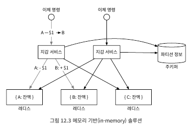

# 12. 전자 지갑
- 고객으로 하여금 지갑에 돈을 넣어 두고 필요할 때 사용할 수 있도록 하는 결제 기능 제공
- 페이팔과 같은 플랫폼은 송금 기능까지 지원 -> 은행 간 이체보다 빠르며 수수료를 부과하지 않음

## 12.1 문제 이해 및 설계 범위 확정
##### 요구사항
- 전자 지갑 간 이체
- 1,000,000TPS
- 99.99%의 안전성
- 트랜잭션
- 재현성

##### 개략적 추정
- TPS 거론은 배후의 트랜잭션 기반 DB를 사용한다는 뜻 -> 데이터센터 노드에서의 RDB는 초당 수천 건의 트랜잭션 지원
  - 데이터베이스 노드는 1,000 TPS 지원 가능 -> 백만 tps 지원은 1,000개의 데이터베이스 노드 필요
  - 이체 명령은 2개의 TPS 처리 필요 -> 인출 연산과 입금 연산 필요
  - 그러하기에 백만 tps는 실질적으로 2백만 tps 필요 -> 2,000개의 데이터베이스 노드 필요
- 하드웨어가 같다고 가정하면 한 노드당 처리할 수 있는 트랜잭션 수가 많을수록 총 노드 수는 줄어듬 -> 하드웨어 비용 절감
- 해당 장 설계 목표 중 하나는 하나의 노드에서 처리할 수 있는 트랜잭션 수를 늘리는 것

## 12.2 개략적 설계안 제시 및 동의 구하기
- 아래와 같은 내용 설명
  - API 설계
  - 세가지 개략적 설계안
    - 간단한 메모리 기반 솔루션
    - 데이터베이스 기반 분산 트랜잭션 솔루션
    - 재현성을 갖춘 이벤트 소싱 솔루션

##### API 설계
- 하나의 API만 구비하면 됨

| API                               | 기능                   |
|-----------------------------------|----------------------|
| POST /v1/wallet/balance_transfer | 한 지갑에서 다른 지갑으로 자금 이체 |

- 요청 인자는 다음과 같음

| 필드             | 설명                           | 자료형              |
|----------------|------------------------------|------------------|
| from_account   | 자금을 인출할 계좌                   | string           |
| to_account     | 자금을 이체할 계좌                   | string           |
| amount         | 이체할 금액                       | string           |
| currency       | 통화 단위                        | string(ISO 4217) |
| transaction_id | 중복 제거(deduplication)에 사용할 ID | uuid             |

- 응답 본문 사례
```
{
  "status": "success",
  "transaction_id": "01589980-2664-11ec-9621-0242ac130002"
}
```
 - amount 자료형은 string -> 이기종 간 다른 자료형 인식으로 인한 오차 발생 위험 제거
##### 인메모리 샤딩
- 지갑 애플리케이션은 모든 사용자 계정의 잔액을 유지
  - <사용자,잔액> 관계의 해시 테이블 구조의 map 또는 키-값 저장소 활용 선호
- 인메모리 저장소로 redis 선호
  - 한대로 100만 TPS처리는 한계가 있음 -> 클러스터 구성 및 사용자 데이터 분산(파티셔닝 또는 샤딩)
- 키-값 데이터를 n개의 파티션에 고르게 분포하려면? 해시 값을 계산하고 파티션 n으로 나눔 -> 파티션 번호
```
String accountID = "A";
Int partitionNumber = 7;
Int myPartition = accountID.hashCode() % partitionNumber;
```
- 모든 레디스 노드의 파티션 수 및 주소는 한군데 저장 -> 높은 가용성 보장을 위해 주키퍼 이용도 좋음
- 해당 방안 마지막 요소는 이체 명령 처리를 담당하는 서비스 -> 지갑 서비스(wallet service)
  - 이체 명령 수신
  - 이체 명령 유효성 검증
  - 명령이 유효한 것으로 확인되면 이체에 관계된 두 계정의 잔액 갱신
- 무상태이며, 수평적 규모 확장 용이


  <br>
- 위 예제는 3개의 레드스 노드가 존재
- 클라이언트 A에서 B로 1달러 이체 명령
  - 한개의 노드는 A의 계정이 포함된 레디스 노드는 1달러 차감
  - 클라이언트 B의 계정이 포함된 레디스 노드는 1달러 더함
- 문제점: 원자적 트랜잭션 보장 못함
  - 첫번 째 업데이트를 끝낸 후 두 번째 업데이트를 완료하기전 서비스 노드가 죽으면 데이터 일관성 이슈 생김

##### 분산 트랜잭션
- 데이터 베이스 샤딩
  - 서로 드란 두 개 저장소 노드를 갱신하는 연산을 원자적으로 수행하려면?
    - 레디스 노드를 트랜잭션을 지원하는 관계형 데이터베이스 노드로 교체
    - 서로 다른 두 데이터베이스 서버에 있는 계정 2개 업데이트 해야하지만 동시 처리 보장 없음
  - 분산 트랜잭션: 2단계 커밋
    - 분산 트랜잭션은 여러 프로세스를 원자적인 하나의 트랜잭션으로 묶는 방법 
    - 저수준 방안이며 
  - 분산 트랜잭션: TC/C
  - 분산 트랜잭션: 사가
##### 이벤트 소싱

## 12.3 상세 설계
##### 고성능 이벤트 소싱
##### 신뢰할 수 있는 고성능 이벤트 소싱
##### 분산 이벤트 소싱