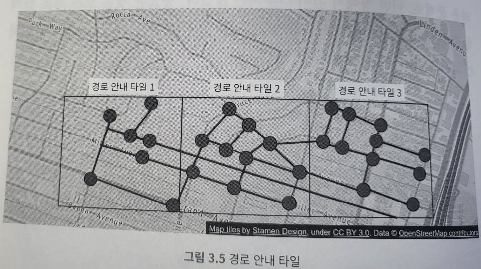
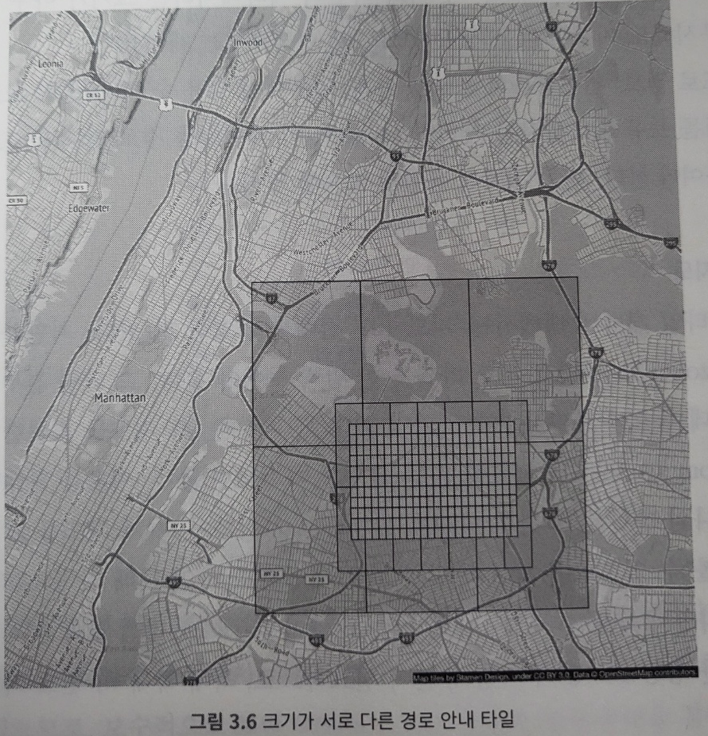
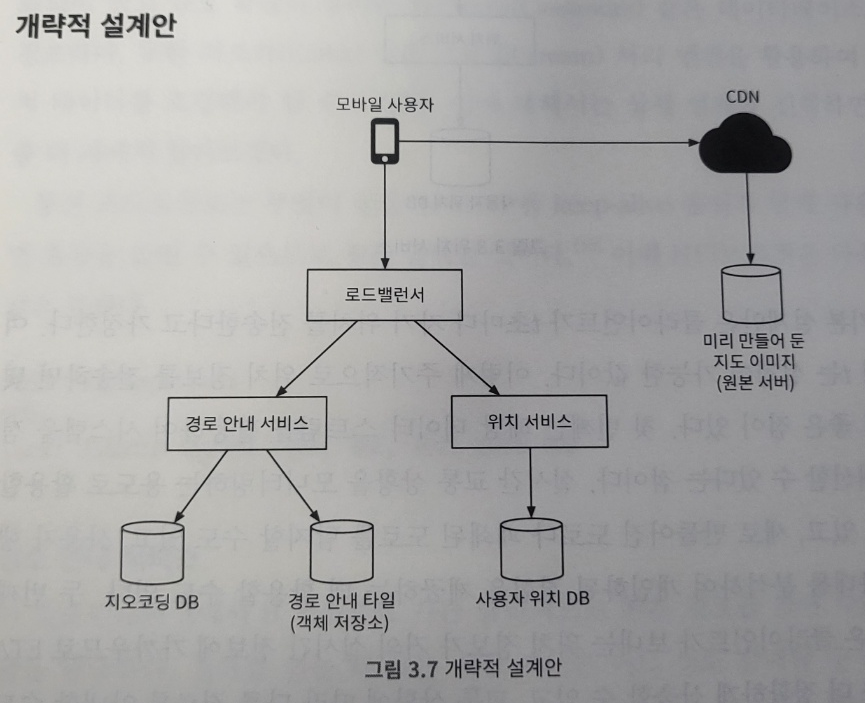
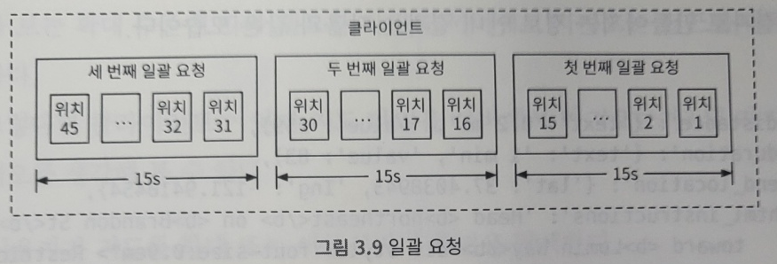

# 3. 구글 맵
- 웹 기반 지도 서비스
- 구글맵 DAU 10억명, 실시간 위치 정보 2500만 건 갱신

## 3.1 문제 이해 및 설계 범위 확정
##### 기능 요구사항
- 사용자 위치 갱신
- 경로 안내 서비스(ETA 서비스 포함)
- 지도 표시

##### 비 기능 요구사항 및 제약사항
- 정확도: 사용자에게 정확한 경로 안내
- 부드러운 경로 표시: 경로 안내가 지도 화면에 아주 부드럽게 표시 및 갱신
- 데이터 및 배터리 사용량: 최소한의 데이터와 배터리 사용
- 가용성 및 규모 확장성 

##### 지도 101
- 측위 시스템
  - 구 쇼면 상의 위치를 표현하는 체계
  - 위도 경도 측정
- 3차원 위치의 2차원 변환
  - 3차원 구 위의 위치를 2차원 평면에 대응시키는 절차를 도법이라 부름
  - 도법은 다양하며, 대부분 기하학정 특성을 왜곡함
  - 구글은 웹 메르카토르 도법을 채택
- 지오코딩
  - 주소를 지리적 측위 시스템의 좌표로 변환하는 프로세스
    - '1600 Amphitheatre Parkway'(주소) → 위도 37.433021, 경도 -122.083739
  - 좌표를 주소로 변경하는 걸 '역 지오코딩'이라 부름
  - 지오코딩을 수행하는 한가지 방법은 인터폴레이션
    - GIS와 같은 다양한 시스템이 제공하는 데이터를 결합
- 지오해싱
  - 지도 위 특정 영역을 영문자와 숫자로 구성된 짧은 문자열에 대응시키는 인코딩 체계
  - 2차원 평면 공간의 지리적 위치를 격자로 표현하여 문자열과 대응
- 지도 표시
  - 지도를 화면에 표시하는 가장 기본이 되는 개념은 '타일'
    - 지도 전부를 하나의 이미지로 표시 x → 작은 타일로 쪼개어 표시,
    - 사용자가 보려는 영역에 관계된 타일만 다운 받아 이어 붙인 다음 화면에 뿌림
- 경로 안내 알고리즘을 위한 도로 데이터 처리
  - 대부분 경로 탐색 알고리즘은 다익스크라 알고리즘 또는 A* 경로 탐색 알고리즘의 변종
    - 대부분 노드와 선으로 표현하는 그래프 자료 구조를 가정함
  - 경로 탐색 알고리즘의 성능은 주어진 그래프 크기에 아주 민감함
    - 탐색 범위가 넓을 수록 메모리도 많이 들면서 성능도 낮음
    - 좋은 성능을 위해 그래프를 관리 가능 단위로 분할 필요
  - 타일 기반 분할법과 유사한 경로 안내타일을 통해 필요한 메모리을 낮출수 있고 성능도 좋아짐\
    
- 계층적 경로 안내 타일
  - 경로 안내가 효과적일려면 필요한 수준의 구체성을 갖춘 도로 데이터가 필요
    - 지번 수준 정밀도 타일을 가지고 알고리즘을 돌리면 너무 많은 시간이 걸림
  - 보통 구체성 정도를 상,중,하로 구분하여 세 가지 종류의 경로 안내 타일을 준비
    - 상: 크기가 아주 작으며 지방도(local roads) 데이터만 둠
    - 중: 넓은 지역 커버, 관할구를 잇는 간선 도로 데이터만 둠
    - 하: 도시와 주를 연결하는 주요 고속도로 데이터만 둠\
      

##### 개략적 규모 추정
- 모바일 단말이므로, 데이터 사용량과 배터리 효율이 중요
- 저장소 사용량
  - 다음 세가지 종류 데이터 저장
    - 세계 지도
      - 지원하는 확대 수준(zoom level)별로 지도 타일을 한 벌씩 두어야함
        - 세계 지도를 21번 확대하여 보려면 4.4조개의 타일이 필요(확대 레벨 0: 타일 1개 필요)
        - 한장의 타일이 256 x 256 png 파일이면 100kb이므로, 4.4조 x 100kb = 440 pb 필요
        - 하지만 지구 표면 가운데 90%는 인간이 살지 않는 지역(바다, 사막 등)
          - 해당 부분의에 대해 80~ 90% 정도 저장 용량 절감 가능
          - 440pb → 40pb ~ 88pb로 줄어드림, 어림 잡아 50pb로 계산
        - 확대 수준 1씩 떨어질때 마다 필요한 타일 수는 1/4로 줄어듬 
          - 50 + 50/4+ 50/16.... =~ 67PB, 대략 100PB 정도 소요됨 
    - 메타데이터: 각 지도 타일의 메타데이터는 크기가 아주 작아서 무시
    - 도로 정보: 외부에서 받은 도로 데이터를 경로 안내 타일로 변환
- 서버 대역폭
  - 서버가 처리해야 하는 요청
    - 경로 안내 요청
      - DAU 10억, 사용자당 경로 안내 기능을 주당 35분 사용 가정이면 주당 350억 분, 즉 하루에 50억분
    - 위치 갱신 요청
      - 사용자 GPS를 매초 전송하면 하루 3000억건 발생(50억 분 x 60) 이는 300만 QPS 발생(3000억건 요청/ 105)
      - 여러 사항을 고려하면 매 초 보낼 필요 없기에 15초 정도 텀으로 보냄 → 300백만 / 15 = 20만
      - 최대 QPS는 평균치의 다섯배로 가정하면 1백만임(20만 x 5)

## 3.2 개략적 설계안 제시 및 동의 구하기
\
##### 위치 서비스
- 사용자의 위치를 기록하는 역할
- t초 마다 자기 위치를 전송한다고 가정
  - 해당 데이터 스트림을 활용하여 시스템을 점차 개선할 수 있음 → 실시간 교통 상황 모니터링, 도로나 폐쇄된 도로 탐지 등
  - 클라이언트가 보내는 정보는 거의 실시간이므로, 교통 상황에 따라 다른 경로를 안내 가능
  - 위치 이력을 클라이언트 버퍼링 해두었다가 일괄 용청하면 전송 빈도를 줄일 수 있음\
    
- 구글 맵과 같은 경우 갱신 요청 빈도를 줄여도 여전히 많은 쓰기 요청을 처리
  - 쓰기 요청에 최적화되어 있고 규모확장이 유리한 카산드라 같은 데이터베이스 필요
  - 카프카나 스트림 처리 엔진을 활용하여 위치 데이터를 로깅 가능
- 통신 프로토콜은 HTTP 및 keep-alive 옵션을 활용하면 효율을 높일 수 있음

##### 경로 안내 서비스
- A에서 B 지점으로 가는 합리적인 빠른 경로를 찾아 주는 역할
- 결과 산출을 위한 시간 감내, 최단 경로일 필요는 없으나 정확도는 보장되어야 함
- 경로 재탐색이나 교통 상황 변화 같은 문제는 고려되지 않음 → 적응형 ETA를 통해 해결 가능

##### 지도 표시
- 클라이언트의 위치 및 보는 확대 수준에 따라 필요한 타일을 서버에서 가져오는게 바람직함
  - 클라이언트가 지도를 가지고 있는 것은 좋지 않음 → 확대 수준별로 한벌씩 지도 타일 저장하려면 수백 PB 필요
- 클라이언트가 지도 타일을 가져오는 시나리오
  - 사용자가 지도를 확대 또는 이동시키며 주변을 탐색
  - 경로 안내가 진행되는 동안 사용자의 위치가 현재 지도 타일을 벗어난 인접 타일로 이동
- 시나리오에 따른 선택지
  - 선택지 1
    - 클라이언트 위치와 지도의 확대 수준에 근거하여 즉석에서 지도 타일 생성
      - 지도 타일을 동적으로 만들어야 해서 서버에 심각한 부하
      - 캐시 활용이 어려움
  - 선택지 2
    - 미리 만들어 둔 지도 타일을 클라이언트에게 전달, 정적 이미지는 CDN을 통해 서비스 제공
      - 규모 확장에 용이하고 성능 측면도 유리함
      - 지도 타일은 정적이기에 캐시를 통해 서비스 하기도 유리
- URL은 모든 격자의 지오해시 값이 있음을 이용
  - https://cdn.map-provider.com/tiles/9q9hvu.png
  - 지오해시 계산은 클라이언트에서 해도 되지만 다중 플랫폼이 될시 문제 생길 수 있음
  - 위도/경도 및 확대 수준을 타일 URL로 변환하는 서비스를 별도로 두는 것도 고려

## 3.3 상세 설계
- 