# 4. 분산 큐
- 잘 정의된 인터페이스를 경계로 나뉜 작고 독립적인 블록들 사이의 통신과 조율 담당
  - 결합도 완화: 컴포넌트 사이의 강한 결합이 사라짐
  - 규모 확장성: Pub/Sub 시스템을 통해 트래픽 부하에 맞게 독립적으로 늘릴수 있음
  - 가용성 개선: 특정 컴포넌트에 장애가 발생해도 다른 컴포는트는 큐와 계속 상호 작용
  - 성능 개선: 메시지 큐를 이용하면 비동기 통신이 쉽게 가능
- 메시지 큐 대 이벤트 스트리밍 플랫폼
  - 최근 들어 메시지 큐와 이벤트 스트리밍 플랫폼간 차이가 없어짐

## 4.1 문제 이해 및 설계 범위 확정
##### 기능 요구사항
- 생산자는 메시지 큐에 메시지를 송신
- 소비자는 메시지 큐를 통해 메시지를 수신
- 메시지는 반복적 수신 또는 한번만 수신 가능하게 할 수 있어야함
- 오래된 이력 데이터는 삭제
- 메시지 크기는 KB 수준
- 메시지가 생성된 순서대로 소비자에게 전달할 수 있어야 함
- 메시지 전달 방식은 최소 한 번, 최대 한 번, 정확히 한 번 가운데 설정할 수 있어야 함

##### 기능 요구사항
- 높은 대역폭과 낮은 전송 지연 가운데 하나를 설정 선택 가능
- 규모 확장성: 분산 시스템이며, 메시지량이 급증해도 처리 가능
- 지속성 및 내구성: 데이터는 디스크에 지속적으로 보관 및 여러 노드에 복제

##### 전통적 메시지 큐와 다른점
- 전통적인 메시지 큐는 이벤트 스트리밍 플랫폼과 아래와 다름
  - 메시지 보관 문제를 중요하게 다루지 않음
    - 메시지가 소비자에 전달되는 충분한 기간 동안만 메모리에 보관
    - 처리 용량을 넘어서면 디스크에 보관히지만, 이벤트 스트리밍 플랫폼 보단 용량이 매우 낮음
  - 전달 순서를 보장하지 않음

## 4.2 개략적 설계안 제시 및 동의 구하기
- 메시지 큐의 기본 기능 
 
  - 생산자는 메시지를 메시지 큐에 발행
  - 소비자는 큐를 구독 및 구독한 메시지 소비
  - 생산자와 소비자 사이의 결합을 느슨, 생산자와 소비자의 독립적인 운영 및 규모 확장을 가능하게 하는 역할
  - 클라이언트 입장에서 서버 역할을 하는건 메시지 큐이며, 이 클라리언트와 서버는 네트워크 통신
- 메시지 모델
  - 가장 널리 쓰이는 메시지 모델은 일대일과 발행 구독(Pub/Sub) 모델

##### 일대일 모델
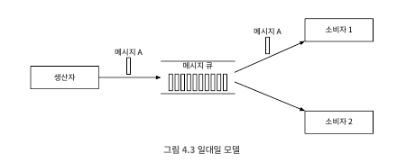 
- 큐에 전송된 메시지는 오직 한 소비자만 가져갈 수 있음
- 어떤 소비자가 메시지를 가져갔다는 사실을 큐에 알리면(ack) 해당 메시지는 \
- 큐에서 삭제
  - 해당 모델은 데이터 보관을 지원하지 않음
  - 본 설계안은 메시지를 2 주 동안은 보관할 수 있도록 하는 지속적 계층을 포함, 해당 계층을 통해 메시지가 반복적으로 소비

##### 발행-구독 모델
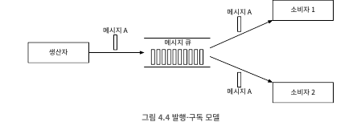 
- 발행-구독 모델을 설명하려면 토픽(topic)이라는 새로운 개념을 도입
  - 메시지를 주제별로 정리하는데 사용
  - 메시지 큐 서비스 전반에 고유한 이름을 가짐
- 토픽에 전달된 메시지는 해당 토픽을 구독하는 모든 소비자에 전달
- 발행-구독 모델은 토픽을 통해 구현할 수 있으며, 일대일 모델은 소비자 그룹을 통해 지원

##### 토픽,파티션,브로커
- 토픽은 보관되는데, 서버 하나가 감당하기 힘든 상황이 벌어지면? 파티션, 즉 샤당 기법 활용 
  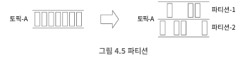 
  - 토픽을 여러 파티션으로 분할한 다음에 메시지를 모든 파티션에 균등하게 나눠 보냄
  - 파티션은 메시지 큐 클러스트 내의 서버에 고르게 분산 배치
  - 파티션을 유지하는 서버는 보통 브로커라고 부름 
    - 브로커에 분산하는 것이 높은 규모 확장성을 달성하는 비결
  - 토픽의 용량을 확장하고 싶으면 파티션 개수를 늘리면 됨
  - 토픽 파티션은 FIFO 처럼 동작 -> 같은 파티션 안에서는 메시지 순서가 유지

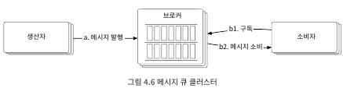 

##### 소비자 그룹
- 소비자 그룹 내 소비자는 토픽에서 메시지를 소비하기 위해 노력
  - 하나의 소비자 그룹은 여러 토픽을 구독할 수 있고 오프셋을 별도로 관리 
    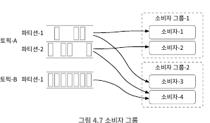 
- 데이터를 병렬로 읽으면 대역폭 측면에서 좋지만 같은 파티션 안에 있는 메시지를 순서대로 소비할 수는 없음
  - 소비자-1과 소비자-2가 같은 파티션-1의 메시지를 읽어야 하면 순서 보장이 안됨 
- 해결 방안으로 하나의 소비자 그룹의 하나의 소비자만 특정 파티션의 메시지 소비
  - 다만, 그룹 내 소비자의 수가 구독하는 토픽의 파티션 수보다 크면 어떤 소비자는 해당 토픽에서 데이터를 일지 못하게 됨
  - 파티션의 메시지는 오직 한 소비자만 가져가는 방법은 일대일 모델에 수렴
    - 처리 용량을 늘리려면 소비자를 늘리면 됨

##### 개략적 설계안
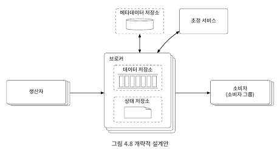 
- 클라이언트
  - 생산자: 메시지를 특정 토픽 송신
  - 소비자 그룹: 토픽을 구독하고 메시지를 소비
- 핵심 서비스 및 저장소
  - 브로커: 파티션들을 유지, 하나의 파티션은 특정 토픽에 대한 메시지의 부분 집합을 유지
  - 저장소
    - 데이터 저장소: 메시지는 파티션 내 데이터 저장소에 보관
    - 상태 저장소: 소비자 상태는 이 저장소에 유지
    - 메타데이터 저장소: 토픽 설정, 토픽 속성 등은 이 저장소에 유지
  - 조정 서비스
    - 서비스 탐색: 어떤 브로커가 살아 있는지 알려줌
    - 리더 산출: 브로커 가운데 하나는 컨트롤러 역할을 담당, 파티션 배치를 책임
    - 아파치 주키퍼나 etcd가 보통 컨트롤러 선출을 담당하는 역할 

## 4.3 상세 설계
- 데이터 장기 보관 요구사항 만족과 함께 높은 대역폭 제공을 위해 세가지 중요한 결정
  - 회전 디스크의 높은 순차 탐색 성능과 현대적 운영체제 지원의 디스크 캐시 적략
  - 메시지가 아무 수정 없이도 전송이 가능하도록 메시지 자료 구조 설계 및 활용
  - 일괄 처리를 우선하는 시스템 설계 -> 소규모 I/O 많으면 높은 대역폭 지원이 어려움

##### 데이터 저장소
- 메시지 큐의 트래픽 패턴
  - 읽기와 쓰기가 빈번하게 잃어남
  - 갱신/삭제 연산이 발생하지 않음
    - 위에 내용은 데이터 스트리밍 관련 데이터 지속성 부분
    - 전통적인 메시지 큐는 메시지가 신속하게 전달되지 못하는 것 외에는 메시지를 지속적으로 보관히자 않음
  - 순차적인 읽기/쓰기가 대부분
- 선택지 1: 데이터 베이스
  - 데이터 베이스 종류
    - 관계형 데이터배이스: 토픽별 테이블 생성 및 토픽 당 메시지는 테이블 내 레코드
    - NoSQL 데이터베이스: 토픽별로 컬렉션을 생성 및 토픽 당 메시지는 하나의 문서
  - 읽기 연산과 쓰기 연산이 동시에 대규모로 빈번하게 발생 상황을 잘 처리하는 데이터베이스는 설계하기 어려움 -> 오히려 병목현상으로 될 가능성이 존재
- 선택지 2: 쓰기 우선 로그(Write-Ahead Log,WAL)
  - 새로운 항목이 추가되기만 하는(append-only) 일반 파일
  - MySql 복구 로그 및 아파치 주피로에도 활용됨
  - 지속성을 보장해야 하는 메시지는 디스크에 WAL로 보관할 것을 추천
    - WAL에 대한 접근 패턴은 읽기/쓰기 전부 순차적 -> 접근 패턴이 순차적이면 디스크는 아주 좋은 성능을 보임
  - 새로운 메시지는 꼬리 부분에 추가 되며, 오프셋은 그 결과로 점진적으로 증가 
    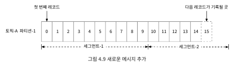 
  - 가장 쉬운 방법은 로그 파일 줄 번호를 오프셋으로 사용
  - 파일 크기도 무한정 커질 수 없으므로, 세그먼트 단위로 나누는 것이 바람직함 
    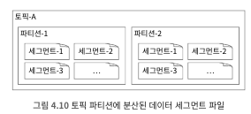 
- 디스크 성능 관련 유의사항
  - 회전 디스크가 느린 것은 데이터 즙근 패턴이 무작위 일 때 발생
  - 순차적 데이터 접근 패턴을 활용하면 수백 MB/sec 수준의 읽기/쓰기 성능 달성하는건 어렵지 않음
  - 가용 가능한 메모리 전부를 디스크 데이터를 캐시하는데 활용해도 성능 올릴수 있음

##### 메시지 자료 구조
- 메시지 자료구조는 생산자, 메시지 큐 및 소비자 사이의 계약이며, 높은 대역폭 달성의 열쇠
- 본 설계안은 메시지가 소비자에게 전달되는 과정에서 불필요한 복사가 일어나지 않도록 함
- 메시지 자료 구조의 스키마 
  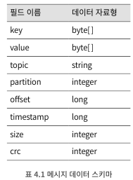 
  - 메시지 키
    - 파티션을 정할 때 사용 -> 키가 주어지지 않으면 무작위로 파티션 배정
    - 키가 주어진 경우 파티션은 hash(key) % numPartitions의 공식에 따라 결정(키는 파티션 번호가 아님)
    - 키는 문자열 또는 숫자일 수도 있으며, 비즈니스 관련 정보가 담기는 것이 보통
    - 파티션 번호는 내부적으로 사용되기에, 클라이언트에게 노출되면 안됨
    - 메시지 값과 연관되어 고유할 필요는 없음 -> 파티션 배정용도임
  - 메시지 값
    - 메시지의 내용, 즉 페이로드를 말함
    - 일반 텍스트일 수 있고, 이진 블록일 수도 있음
  - 메시지의 기타 필드
    - 토픽: 메시지가 속한 토픽 이름
    - 파티션: 메시지가 속한 파티션의 ID
    - 오프셋: 파티션 내 메시지의 위치
    - 타임스탬프: 메시지가 저장된 시각
    - 크기: 메시지의 크기
    - CRC: 순환 중복 검사, 데이터 무결성 보장하는데 이용

##### 일괄 처리
- 생산자, 소비자 및 메시지 큐는 메시지를 가급적 일괄 처리함
- 일괄 처리가 성능 개선에 중요한 이유
  - 여러 메시지를 한 번의 네트워크 요청으로 전송 -> 값비싼 네트워크 왕복 비용을 제거 가능
  - 브로커가 여러 메시지를 한 번에 로그에 기록하면 더 큰 규모의 순차 쓰기 연산이 발생하고, 운영체제가 관리하는 디스크 캐시에서 더 큰 규모의 연속 공간 점유 -> 더 높은 디스크 접근 대역폭을 달성 
  (?) 이해가 잘 안됨... 해당 부분에서 디스크 캐시 부분이 이해가 잘 안됨...
  - 높은 대역폭과 낮은 응답 지연은 동시에 달성하기 어려움
    - 시스템이 낮은 응답 지연이 중요한 전통적 메시지 큐로 이용된다면 일괄 처리 메시지 양은 낮춤 -> 디스크 성능은 다소 낮아짐
    - 처리량을 높여야 한다면 토픽당 파티션의 수는 늘림 
    
    (?) 분산 처리를 하면 높은 대역폭과 낮은 응답 지연을 동시에 달성되지 않나?
  
##### 생산자 측 작업 흐름
- 생산자는 라우팅 계층을 통해 적절한 브로커에 메시지를 전달
- 브로커가 여러 개로 복제하여 운영하는 경우에 리더 브로커가 메시지를 수신 
  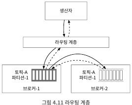 
  - 생산자는 메시지를 라우팅 계층에 전달
  - 라우팅 계층은 메타 데이터 저장소에서 사본 분산 계획을 읽어 캐시에 보관 및 이에 따라 시행 -> 리더 브로커인 브로커-1에 전달
  - 리더 사본이 우선 메시지를 받고 사본은 해당 리더로부터 데이터를 수신
  - '충분한' 수의 사본이 동기화되면 리더는 데이터를 디스크에 기록 -> 데이터가 소비 가능한 상태가 되는 이시점
- 장애 감내가 가능한 시스템을 만들기 위해 리더와 사본은 필요
- 위와 같은 '사본 동기화'는 아래와 같은 단점 존재
  - 라운팅 계층을 도입하면 네트워크 노드가 하나 들어 오버헤드 발생 -> 네트워크 전송 지연
  - 일괄 처리 부분을 고려하지 않은 설계
- 라우팅 계층을 생산자 내부로 편입 후 버퍼 도입한 설계안 
  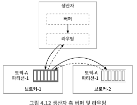 
  - 네트워크 거칠 필요가 없어 전송 지연 감소
  - 생산자가 메시지를 어느 파티션에 보낼지 결정하는 자신만의 로직 갈질 수 있음
  - 버퍼 메모리를 통해 일괄 전송하여 대역폭을 높일 수 있음
- 대역폭과 응답 지연 사이에서 일괄 처리에 대한 타협점을 찾아야 함 
  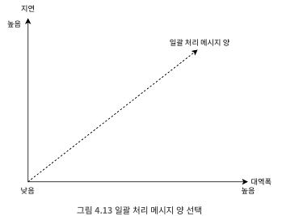 
  - 일괄 처리할 메시지 양을 늘리면 대역폭 up,응답속도 down -> 메시지가 다 쌓아지길 대기 

##### 소비자 측 작업 흐름
- 특정 파티션의 오프셋을 주고 해당 위치에서부터 이벤트를 묶어 가져옴 
  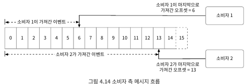 
- 푸시 vs 풀
  - 푸시 모델
    - 장점
      - 낮은 지연: 브로커가 즉시 소비자에게 메시지 전달
    - 단점
      - 소비자 처리 속도가 늦을 경우, 푸시에 대한 부하 발생
      - 생산자가 데이터 전송 속도에 맞게 소비자가 컴퓨팅 자원을 맞춰야함
  - 풀 모델
    - 장점
      - 메시지 소비 속도는 소비자가 결정 -> 일괄 처리도 가능
      - 메시지 소비 속도가 늦어지면 소비자 늘리는 것도 가능 또는 생산 속도 따라 잡을때까지 기다림도 가능
      - 일괄 처리 적합: 소비자 처리 속도로 가늠하여 오프셋을 통해 일괄로 받아오는 것도 가능
    - 단점
      - 브로커에 메시지가 없어도 지속적인 풀 요청 처리
- 메시지 큐는 풀 모델 지원 
  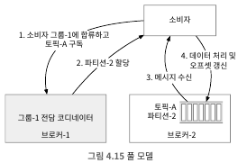 
##### 소비자 재조정
- 어떤 소비자가 어떤 파티션을 책임지는지 다시 정하는 프로세스
  - 소비자에 대한 변경이 있을 시 발생(소비자 합류, 소비자 탈퇴, 소비자 장애등)
- 해당 프로세스는 코디네이터가 중요한 역할함
  - 소비자 재조정을 위해 소비자들과 통신하는 브로커 노드
  - 소비자로부터 오는 박동 메시지를 살피고 각 소비자의 파티션 내 오프셋 정보를 관리
- 코디네이터와 소비자 상호 작용 
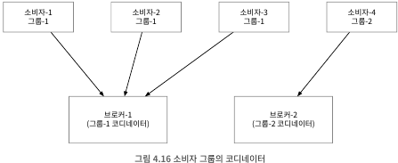 
  - 소비자는 특정 그룹에 속함 -> 그룹 전담 코디네이터 존재
  - 코디네이터는 자신과 연결한 소비자 목록 유지, 목록 변화가 생기면 해당 그룹의 새 리더 선출
  - 새 리더는 파티션 배치 계획을 만들고 코디네이터에게 전달 -> 계획을 그룹내 다른 모든 소비자에게 전달 
    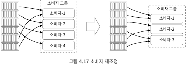 
- 몇가지 재조정 시나리오(소비자 수 2, 토픽 파티션 4)
  - 새로운 소비자 B가 그룹에 합류 
    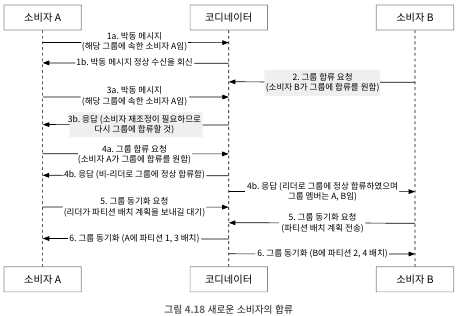 
  - 소비자 A가 그룹을 떠나는 과정 
    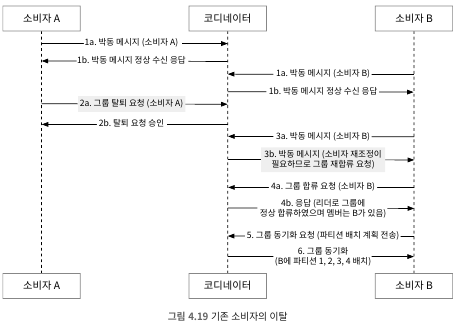 
  - 소비자 A가 비정상적으로 가동 중단 경우 
    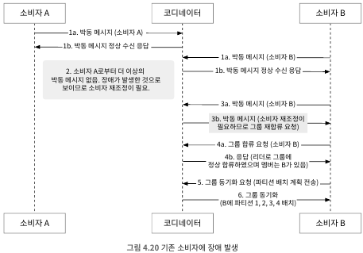 
  
##### 상태 저장소
- 다음과 같은 정보 저장
  - 소비자의 대한 파티션의 배치 관계
  - 각 소비자 그룹이 각 파티션에서 마지막으로 가져간 메시지의 오프셋 
    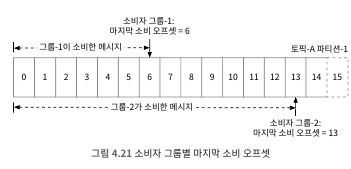 

##### 메타데이터 저장소

##### 주키퍼

##### 복제

##### 사본 동기화

##### 규모 확장성

##### 메시지 전달 방식

##### 고급 기능

## 4.4 마무리
- 시간이 조금 남으면 면접관과 논의할 부분
  - 프로토콜: 노드 사이에 오고 가는 데이터에 관한 규칙, 문법 및 API 규정
    - 메시지 생산과 소비 및 박동 메시지 교환 등의 모든 활동을 설명
    - 대용량 데이터를 효과적으로 전송할 방법을 설명
    - 데이터의 무결성을 검증할 방법을 기술
- 유명한 프로토콜로 AMOP, 카프카 프로토콜 등 존재
  - 메시지 소비 재시도
    - 실패한 메시지를 재처리하려면, 재시도 전용 토픽에 보낸다음 나중에 다시 소비
  - 이력 데이터 아카이브
    - 시간 기반 혹은 용량 기반 로그 보관 메커니즘이 있을시, 이미 삭제된 메시지 처리를 원할때는 HDFS같은 대용량 저장소 시스템이나 객체 저장소에서 보관된 메시지 활용
